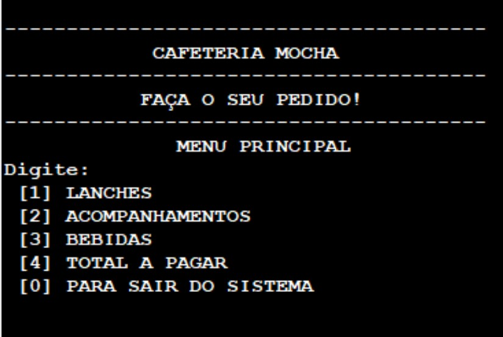

# logica-de-programacao-mmd-un

<h1>Required Course - Fundamentos de Lógica de Programação - Tecnólogo Análise e Desenvolvimento de Sistemas - Uniube
</h1>

<h2>Topics (Conteúdo)</h2>

Required Course - Programming Logic Fundamentals - Technology in Systems Analysis and Development - Uniube.

Exercises practiced during the course and final evaluated project for approval in the discipline.

(Disciplina Obrigatória - Fundamentos de Lógica de Programação - Tecnólogo em Análise e Desenvolvimento de  Sistemas - Uniube.

Exercícios praticados durante o curso e projeto final avaliativo para aprovação na disciplina.)

<h3>Programming Logic Fundamentals</h3>

VisuAlg. Algorithms. Logical and Relational Operators. Control Flow. Loops. Procedures. Validation. Arrays. Functions. Matrices.

VisuAlg. Algoritmos. Operadores Lógicos e Relacionais. Estruturas de Decisão. Estruturas de Repetição. Procedimentos. Validações. Vetores. Funções. Matrizes.

Software: VisuAlg.

Programming language - pseudocode Portugol

Linguagem de programação - pseudolinguagem Portugol.</>

<h2>Projects (Projetos)</h2>

Elaborar um algoritmo no aplicativo VisuAlg para o controle de pedidos de uma cafeteria.

<ul>
<li>Há 05 opções de escolha no menu principal: lanches, acompanhamentos, bebidas, total a pagar e para sair do sistema.</li>
<li>Os menus lanches, acompanhamentos e bebidas possuem 07 subopções de escolha.</li>
<li>No menu principal, o usuário poderá escolher uma opção e ir para a tela da mesma. Se for digitado 0 (zero) o programa será finalizado.</li>
<li>Dentro da opção escolhida (lanches, acompanhamentos ou bebidas) o usuário seleciona a subopção e a quantidade.</li>
<li>São mostrados a quantidade, o valor subtotal e total da subopção.</li>
<li> O sistema permite escolher outra opção dentro do menu que o usuário estiver (lanches, acompanhamentos ou bebidas).</li>
<li> Há uma opção para retornar ao menu anterior - 0 (zero).</li>
<li>No menu "Total a Pagar" é mostrado o subtotal das 03 opções (lanches, acompanhamentos e bebidas) e o valor total do pedido.</li>
</ul>

<!-- <ul>
<li></li>
</ul> -->

<h2>Exercises (Exercícios)</h2>

<!-- <ul>
<li></li>
</ul> -->
